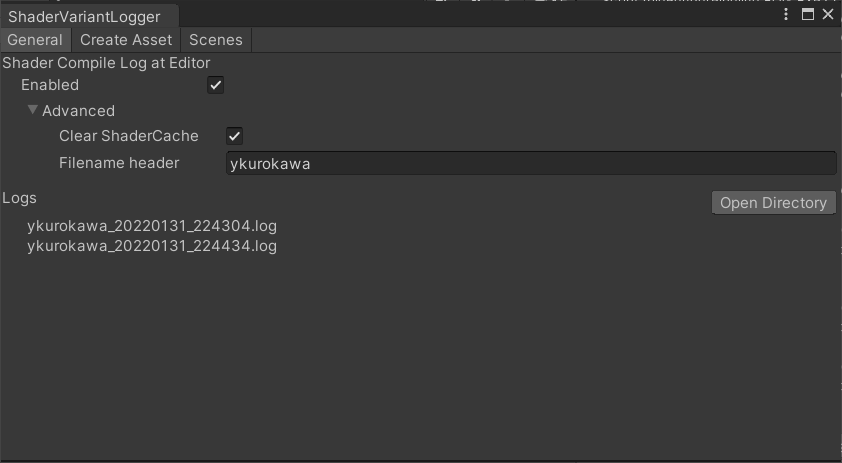
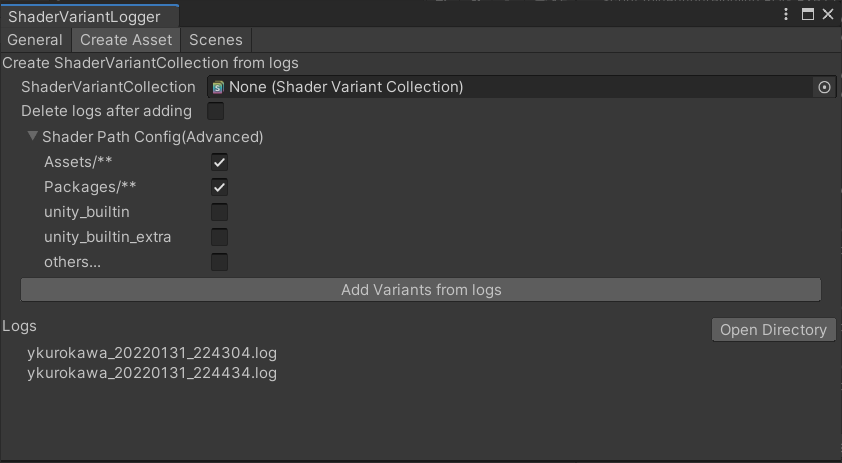

# UnityShaderVariantLoggerForEditor
[日本語はコチラ](README.ja.md) 

Logging the ShaderCompile when running on Editor.
And then generate the ShadervariantCollection from the "ShaderCompile log".

Windows 10 - Mac/ Mac (test with Intel MacOS 12.0)

# How to use

Call "Tools/UTJ/ShaderVariantLogger" and open the window. 

## 1.logging "Shader Compile"
 

If you enabled "Enabled", you play on the UnityEditor and then the "ShaderCompiling log" will be generated in "Library/com.utj.shadervariantlogger/logs" 
If you want to access the log , press the "Open Directory".

Also you can generate ShaderVariantCollection by using this log. 
 
When you play on the Editor,ShaderCache will be deleted every time. 
If you want to stop clear the Shader cachefolder, disable the flag "Clear ShaderCache".
* However some shader compile could be missed when disabling "Clear ShaderCache".

## 2.Generate ShaderVariantCollection from log.

 

Press "Add Variants from logs".

You can select ShaderVariantCollection Asset that you want to add ShaderVariant by selecting "ShaderVariantCollection".
If "ShaderVariant Collection" is none, new file will be generated.

If you enabled "Delete logs after adding",the ShaderCompile logs will be deleted.
Also you can configurate which Shader should be added by "Shader Path Config Advanced".

