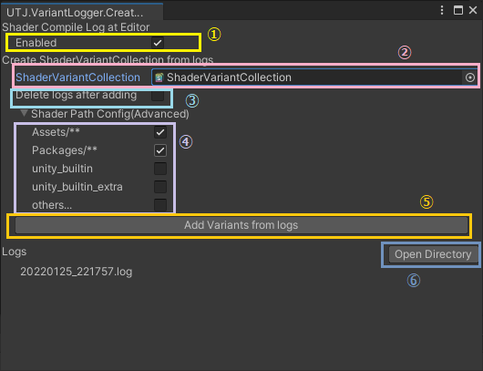

# UnityShaderVariantLoggerForEditor
UnityEditor上で実行した時に、Shaderコンパイルをログに書き出してます。 
そのログをもとにイイ感じにShaderVariantCollectionを作れるようにします。

(今はWindowsOnly)

# 利用方法

メニューの 「Tools/UTJ/ShaderVariantLogger」で下記のWindowを開きます 

 

## 1.Shaderコンパイルのログ収集について

画面の「1.Enabled」が有効な状態ででEditor上でプレイをしていると、Editor上でのShaderコンパイルログが「Library/com.utj.shadervariantlogger/logs」以下に蓄積されます 
このログにアクセスしたいときは⑥のOpen Directoryを押すことでログが溜まっているディレクトリにアクセスすることができます。 

後にこのログをもとにShaderVariantCollectionアセットを作成することが可能です。 
 
※注意点：Editor上でプレイをするごとにShaderCacheを消します。

## 2.ログからVariantCollectionを作成する

「5.Add Variants from logs」を押すことで実行します。

このとき、ログに溜まった内容をもとに「2.ShaderVariantCollection」で指定されたShaderVariantCollectionに対してVariant追加を試みます。 
もし指定がないときには新規にファイルを作成します。

「3.Delete logs after adding」にチェックを入れると、処理完了後にもともとあったログファイルを削除します。
「4.Shader Path Config Advanced」では、Variantに追加するShaderの条件を指定することが可能です。
